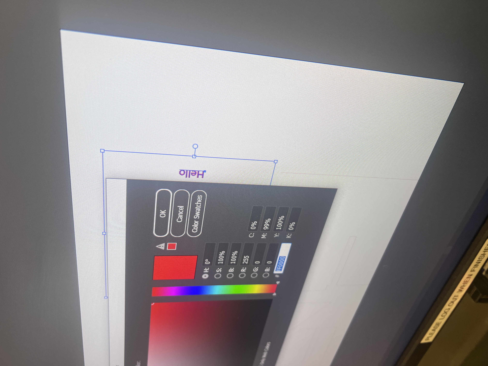
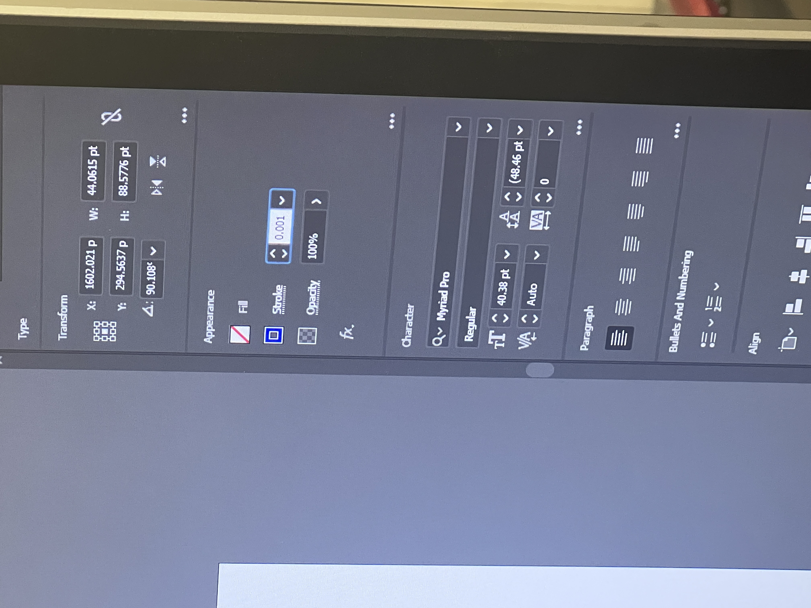
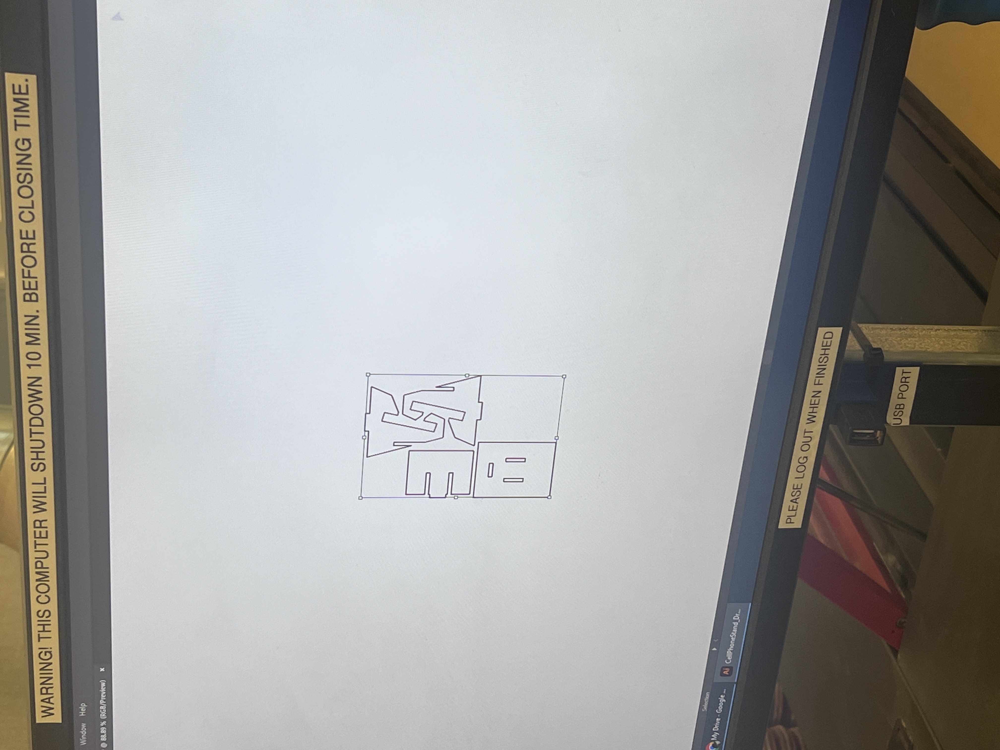
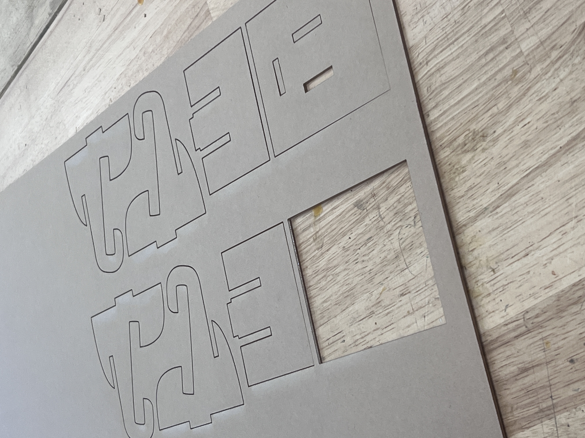
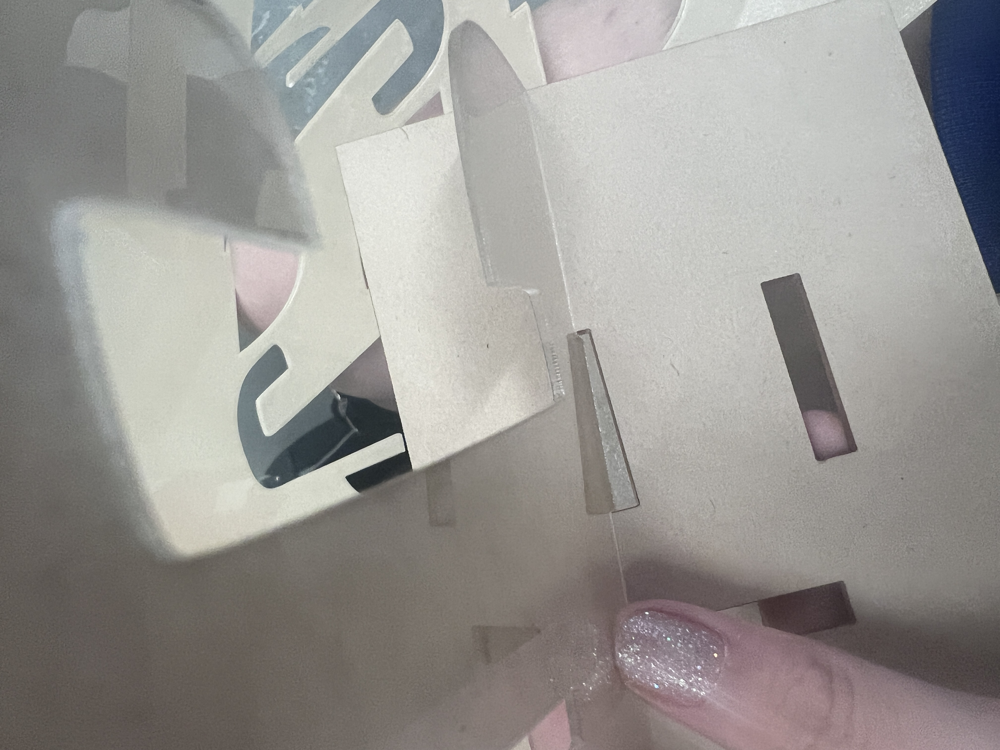

#  Week of 08/28/2023 (Week 2 )
## Zoe(Jiayi) Liu, Technology Design Foundations

### Summary: 

This week,  I learned a lot of things in the process of making a phone stand
Some information about my process:

</img> 
</img> 
</img> 

Here is a link to some [video documentation](https://vimeo.com/859948016?share=copy) I made of my cell phone stand getting cut at Jacobs

---

### Reflections:

I made a mistake in my choice of materials

1. the size of the clear acrylic I purchased is too big, which leads to only one machine I can use in Jacob Hall.

2. the acrylic is too thin 
 

Therefore, next time, I will carefully investigate the materials and measure every detail of the product more carefully.

---

