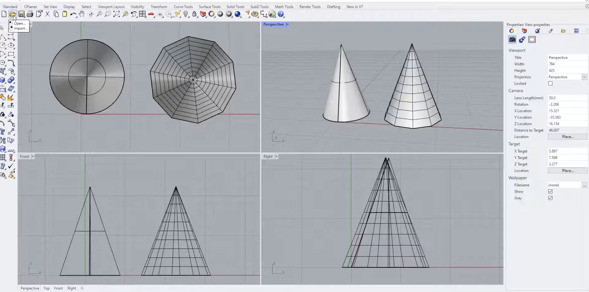
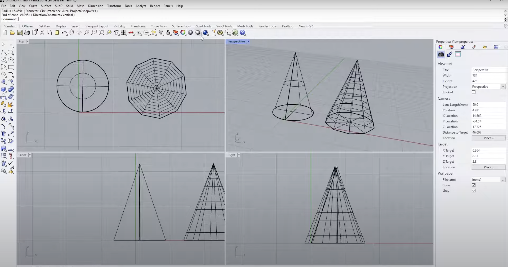

#  Week of 08/28/2023 (Week 2)
## Zoe(Jiayi) Liu, Technology Design Foundations

### Summary: 
I followed step by step with a [YouTube video]([https://www.youtube.com/watch?v=tgPzekCRM9U](https://www.youtube.com/watch?v=tgPzekCRM9U)) to make this chair and made some changes myself.

</img> 
</img> 
</img> 

---

### Reflections:

Learning Grasshopper is like learning  a new node-based language, understanding how different components interact, and producing varied outcomes, which is a shift from my traditional design thinking. 

---
