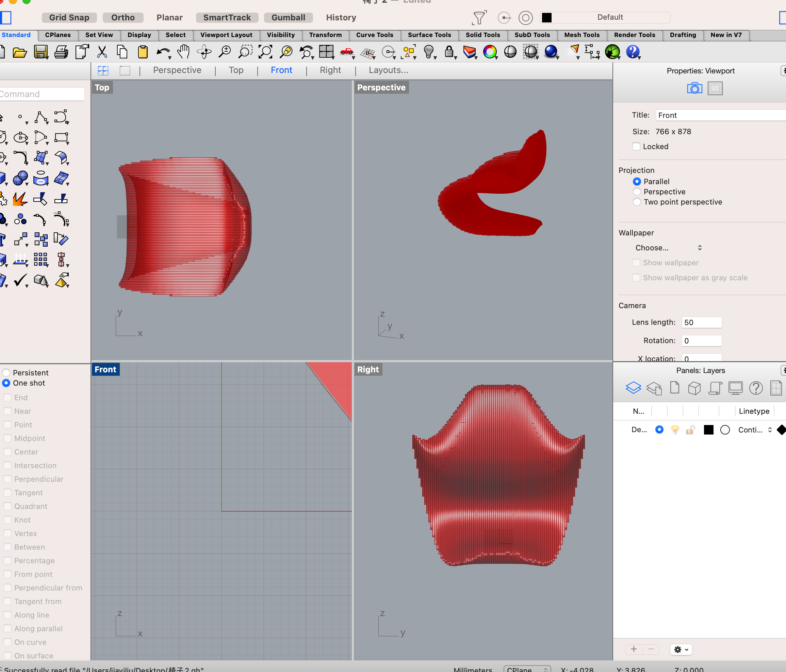
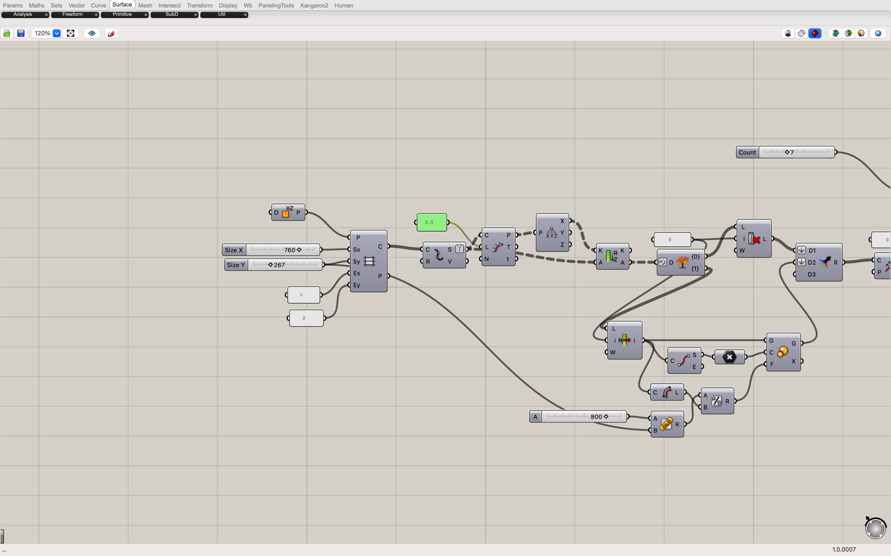
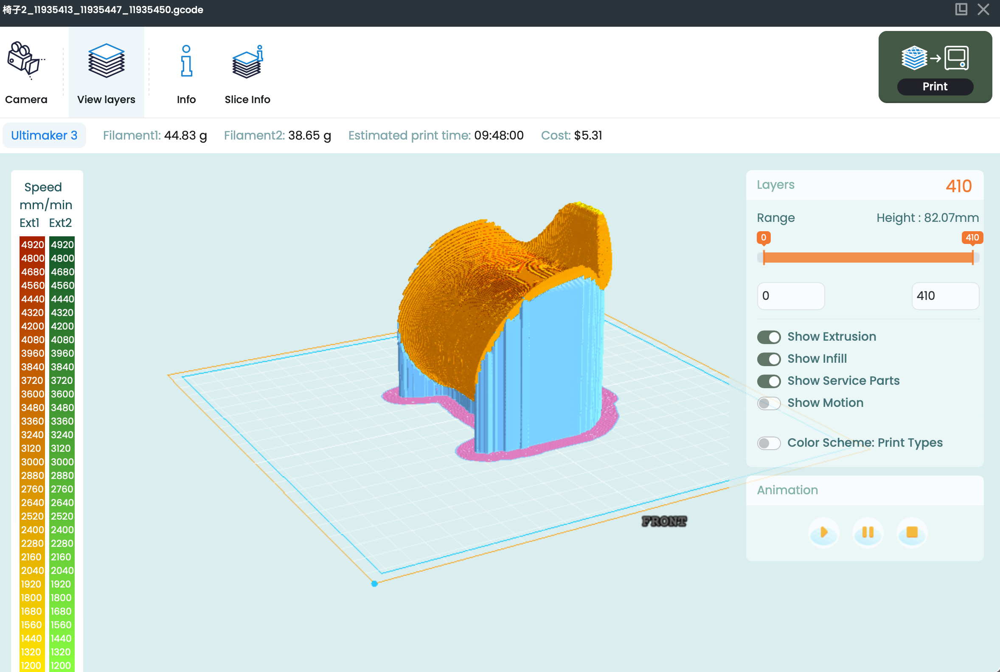
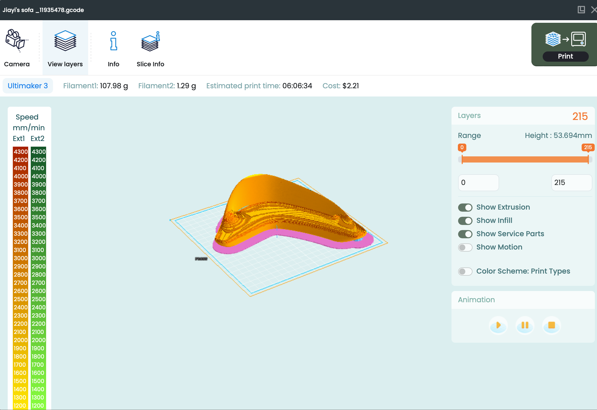

#  Week of 9/14/2023 (Week 4)
## Zoe(Jiayi) Liu, Technology Design Foundations

### Summary: 
This week, I decided to make a support for my little toy, which is my personalized artifact. 
 I followed step by step with a [YouTube video](https://www.youtube.com/watch?v=tgPzekCRM9U)  to make this chair and made some changes myself.

https://www.youtube.com/watch?v=tgPzekCRM9U
</img> 
</img> 
</img> 

First-time use 3dprinteros to slice.

</img> 
</img> 

I also worked on the  [YouTube video](https://www.youtube.com/watch?v=fA1N4DpFmu8) This week.

Given the contrasting functionalities and interfaces, navigating Rhino and Grasshopper is challenging.
The different vision of Rhino with study video leads to complexities in organizing and manipulating data, demanding multiple attempts for accurate representation.

---

### Reflections:

Learning Grasshopper is like learning  a new node-based language, understanding how different components interact, and producing varied outcomes, which is a shift from my traditional design thinking. 

---
