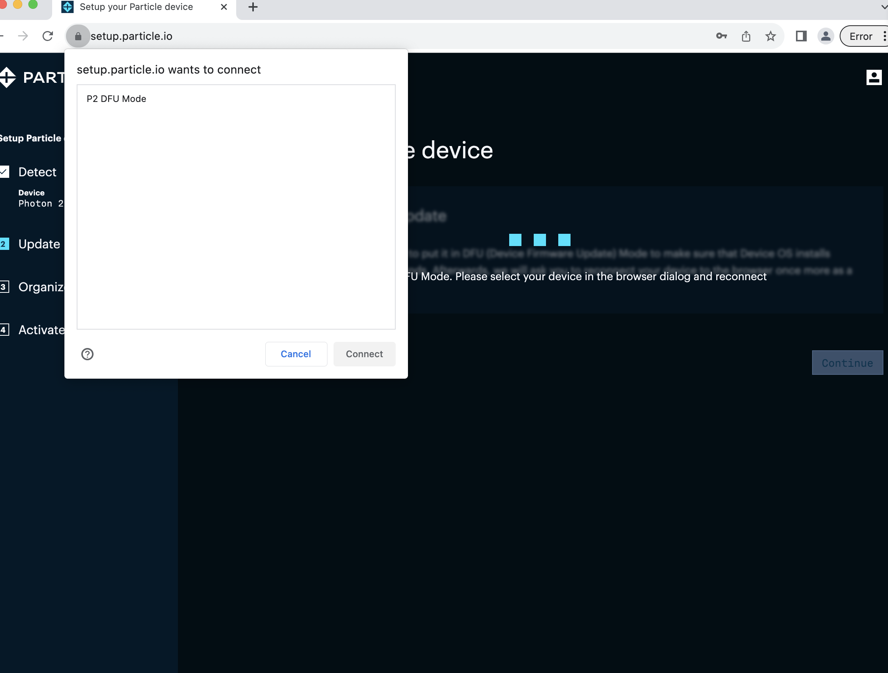
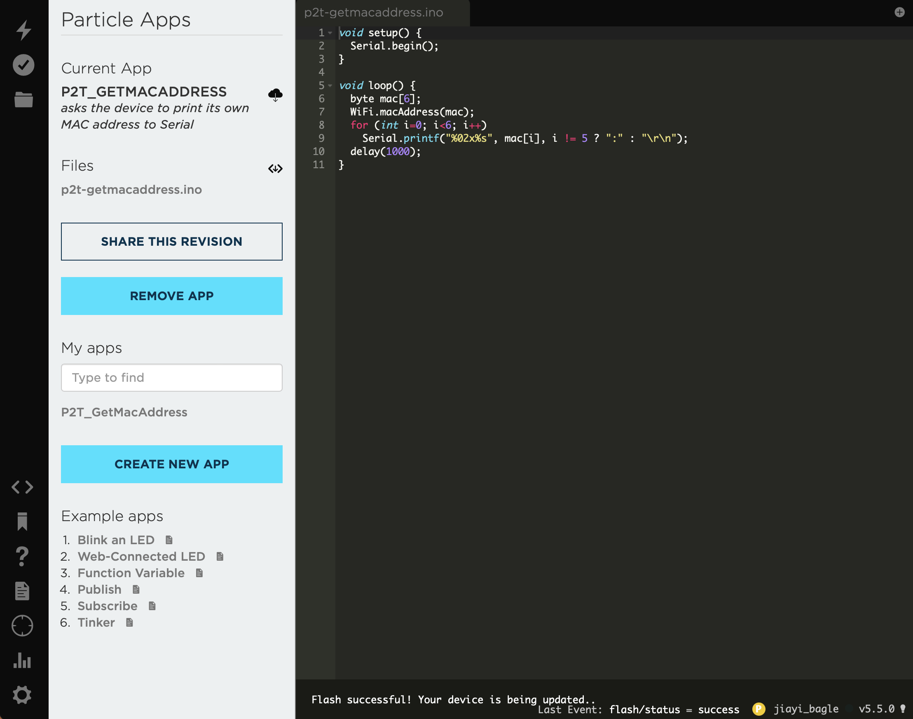

#  Week of 08/28/2023 (Week 2)
## Zoe(Jiayi) Liu, Technology Design Foundations

### Summary: 
This week, I go through the first five steps of the Photon2 setup. 

</img> 
</img>  
</img> 
</img> 
</img> 

---

### Reflections:

I successfully set up the photon2 and look forward to the next class.

---
