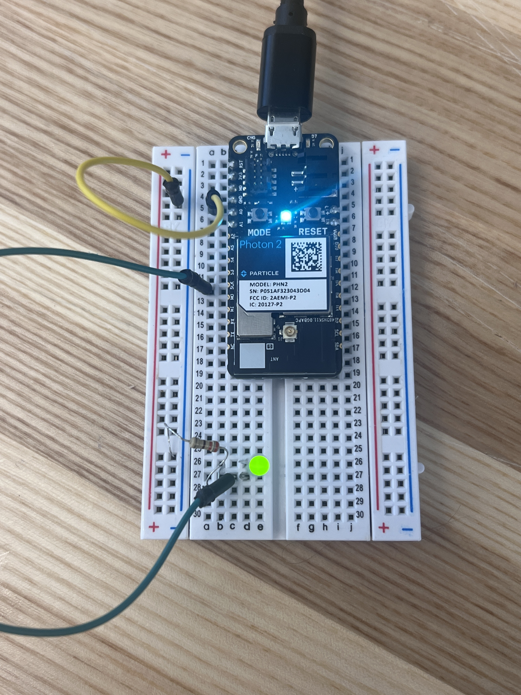

#  Week of 09/28/2023 (Week 2)
## Zoe(Jiayi) Liu, Technology Design Foundations

### Summary: 
This week, I go through how to use LED and sensor

</img> 
</img><br

---

### Reflections:

I need to be more careful in distinguishing between positive and negative

---
