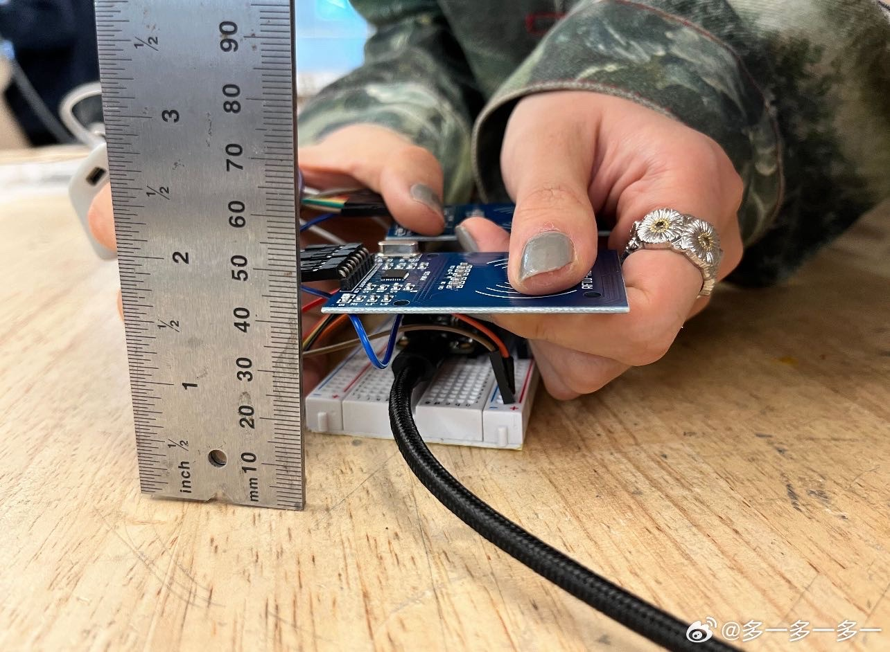
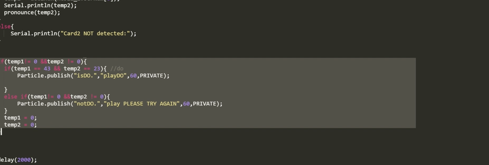
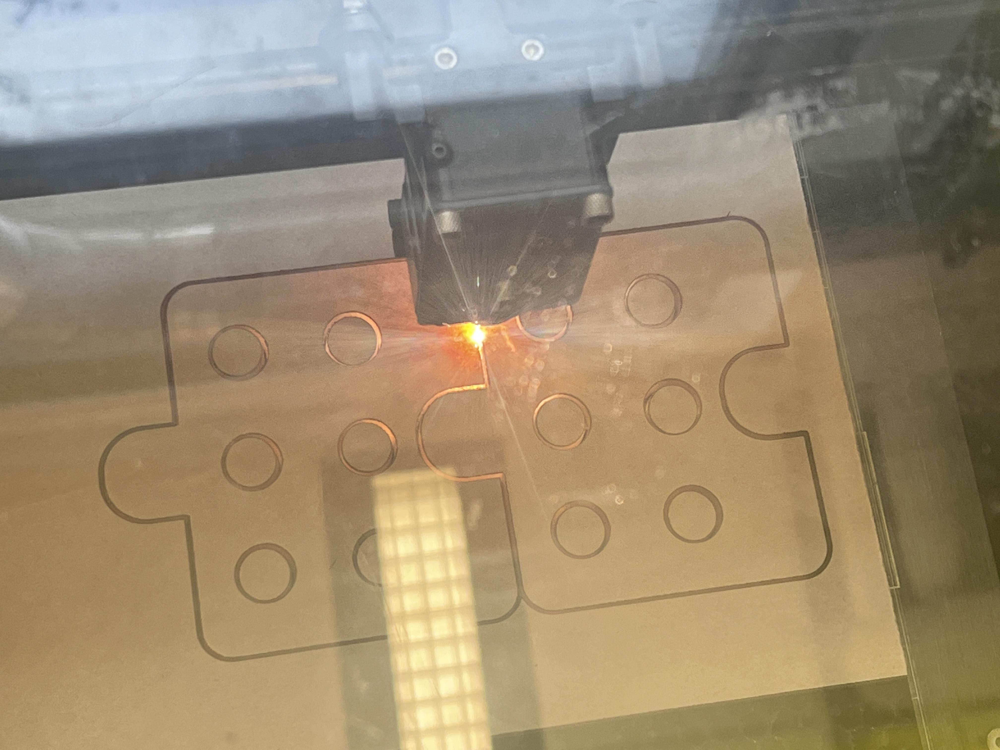
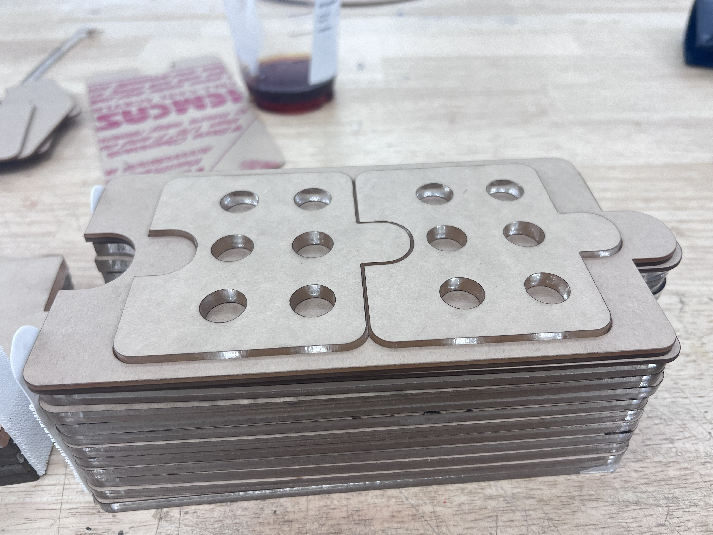

#  Week of 10/12/2023 (Week 8)
## Zoe(Jiayi) Liu, Technology Design Foundations

### Summary: 
This week, I worked with my groupmates on finding a solution for 2 pythons can communicate with each other.

</img> 
</img> 
</img> 
</img> 

I did laser-cut and design for our module。 

</img> 
</img> 

 Getting the Photon2 devices to talk to each other was a big deal. It showed me that sometimes the small details in technology can make things complicated, especially when we're trying to make things that everyone can use easily. I also learned that for the devices to work together, they have to be registered on the same Particle account. This taught me to read instructions more carefully and showed me how complex managing devices can be.
