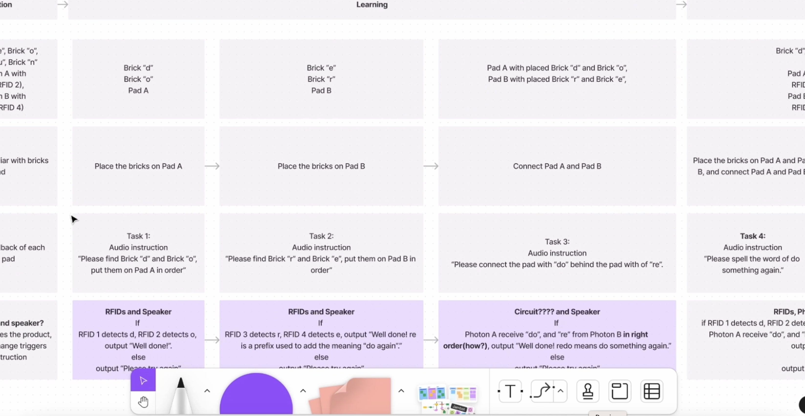

#  Week of 11/02/2023 (Week 10)
## Zoe(Jiayi) Liu, Technology Design Foundations

### Summary: 
This week, I work with Zerowidth, and 
</img> 
</img> 
</img> 
</img> 

Working on this project helped me learn more about how devices talk to each other using publish/ subscribe methods. I found out that even if they can't send data directly, they can still work together well by using events and functions.
